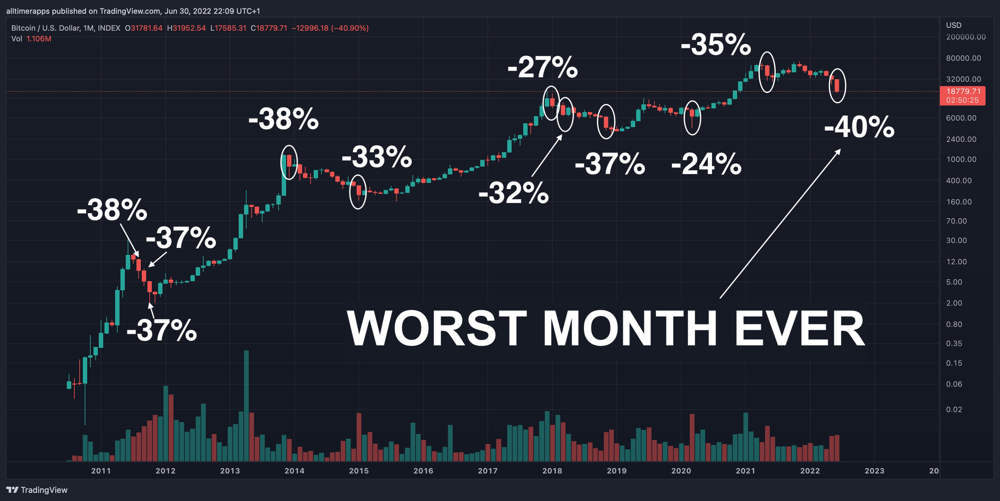
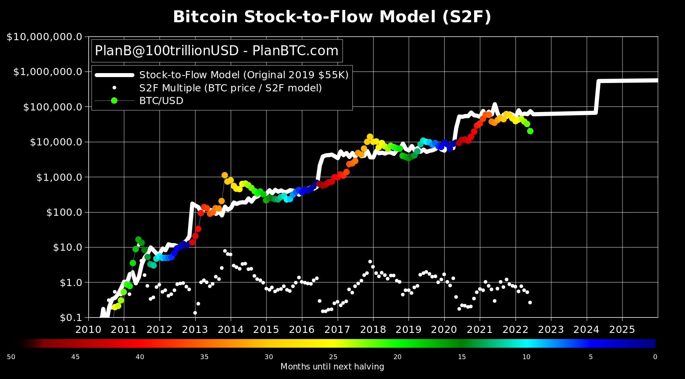
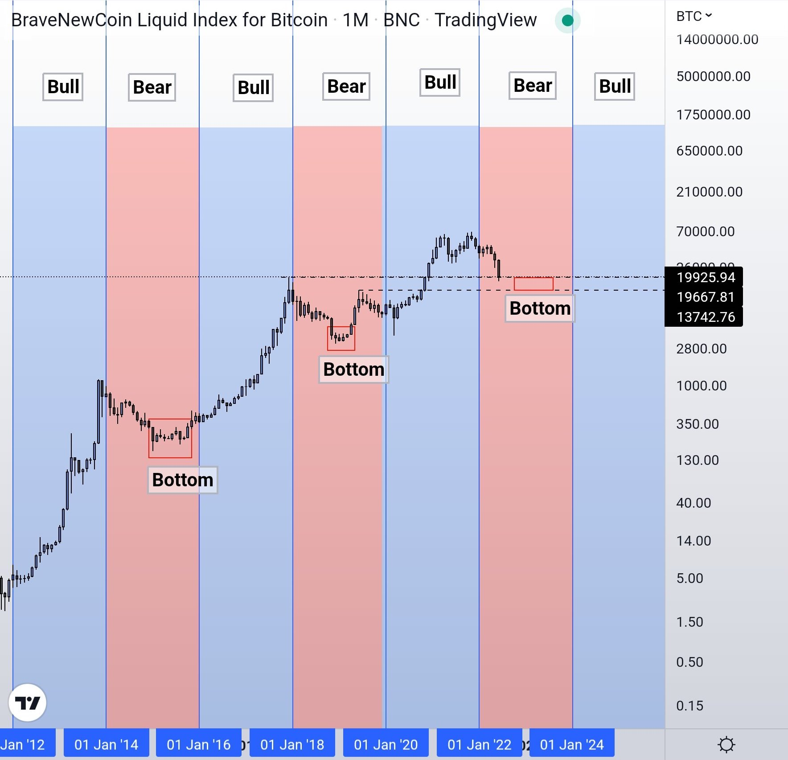
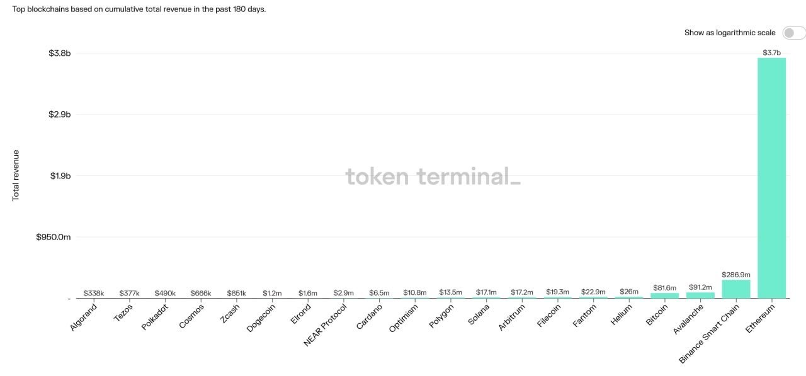
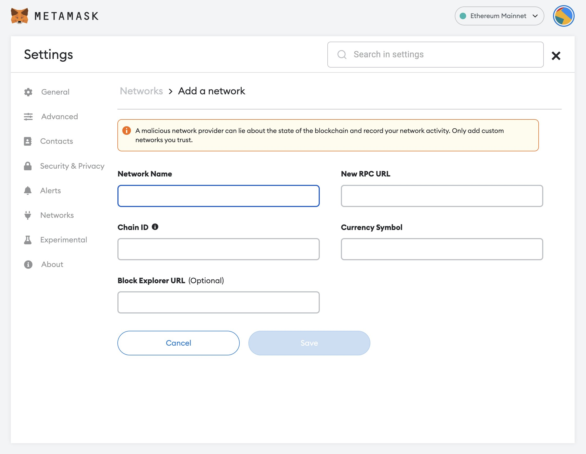
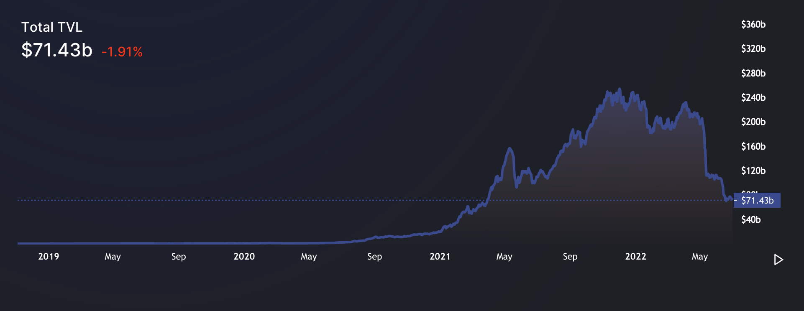
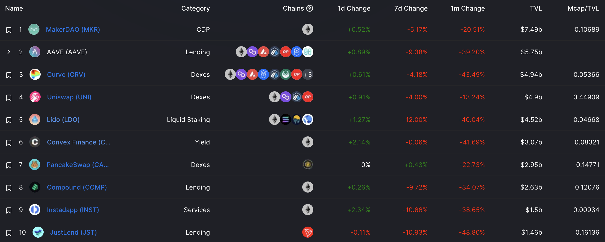
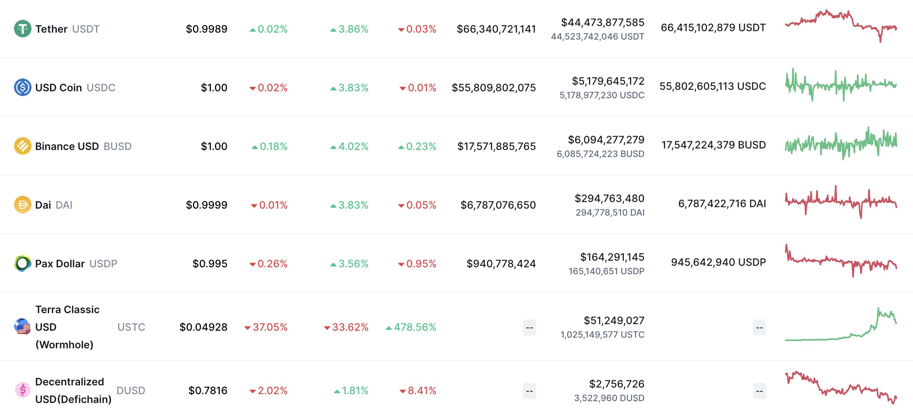
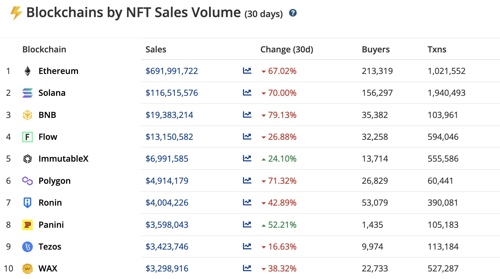

#### Some thoughts on Crypto, Web3 and NFTs. We're still early, until we're late.

--

#### Bitcoin
* Bitcoin closed the worst month ever with -40%. If your time horizon is more than 4 years this doesn't really matter. I'll continue stacking BTC, ETH and 2-3 select altcoins.

[@BitcoinArchive](https://twitter.com/BTC_Archive/status/1542619211272421377)

* PlanB was wrong, a bunch of others too, shit happens. I have to say though that I really bought into the vision of Bitcoin reaching $100k, oh well. The chart still looks okay-ish, even though the dip is much more aggressive than previously. See first point about time horizon.

[@100trillionUSD](https://twitter.com/100trillionUSD/status/1542660589939736576)

* Everybody is talking about 4 year cycles again but ... nobody really knows. The more people think BTC follows a very defined pattern (200 Week MA, 4yrs halving, rainbow charts, etc.), the less I believe in it. What I still think is true though, is that BTC's price should theoretically appreciate due to the limited supply after each halving.

[@CryptoGirlNova](https://twitter.com/CryptoGirlNova/status/1542813364749045760/photo/1)

#### Ethereum, EVMs, L2s

[@TrustlessState](https://twitter.com/TrustlessState/status/1542597067771727874)

* Ethereum is still the king and will remain so for a long(er) time. I think the bear market will actually help both ETH and BTC sucking out liquidity from other chains
* Using L2s (Layer 2) still sucks and MetaMask doesn't help with creating great UX. Bridging is a pain, liquidity is low, tracking where the coins are is hard. Phantom (Solana Wallet) on the other hand does a great job with UX and UI.

* Chains with a multi-chain approach like Avalanche (AVAX) and Polkadot (DOT) make it even more complicated. I call myself quite crypto-savvy and using all these X-, Y-, Z-Chains on AVAX was painful. Do you rather take a nonstop flight somewhere or like stop-overs (L1 > L2)
* Solana is one of the few non EVM chains that do a great job in terms of UX and tooling. The uptime, for now, not so much.
* EVM chains with minimal novelty, or that only use a different consensus mechanism which most of the time it is, will have a hard time once ecosystem funds dry up. Then Ethereum's L2s like Arbitrum, Optimism, etc. will swallow a bunch of their revenue

#### DeFi, NFTs, Fugazis

* A lot of DeFi Fugazis will vanish, at latest when VC funds dry up and there isn't enough user adoption. Generating magic internet money was fun while it latest.
* MakerDAO, the OG of DeFi, remains the protocol with highest TVL

> The crypto carnage was driven by centralized lenders with weak risk controls and minimal collateral requirements. Defi lending protocols operated as designed, and just notched another proof point through a catastrophic risk contagion.
> [Garry Tan](https://twitter.com/garrytan/status/1542833551988498432) on a great article "[Number Three](https://entrepreneurshandbook.co/number-three-511f334d8fae)" by Arthur Hayes

* Stablecoins are a shitshow, don't get me started on algorithmic stable coins. NEAR's originally designed algo-stable USN is launching a version 2.0 that relays on USDT for some time which says it all.

* NFTs have dumped like crazy in price. Usage on Solana and ImmutableX is still going up, which is a good sign. Interestingly, Solana does nearly double the volume of transactions with a little more than half of the buyers. Assets on Ethereum still has the highest valued assets

* Too many shitty NFT derivatives like The Great "Dildo on the nose" Goats, Yeah Tigers and more. The cleansing process has started.
* NFTs that provided you with utility through staking to receive tokens, are having a hard time. Their token price and usage has gone down dramatically. So much that if you still hold some, the only option now is to hodl.

**We're still early, until we're late.**

Bonus Meme: Will Three Arrows Capital rebrand to Three Arrows Classic?

