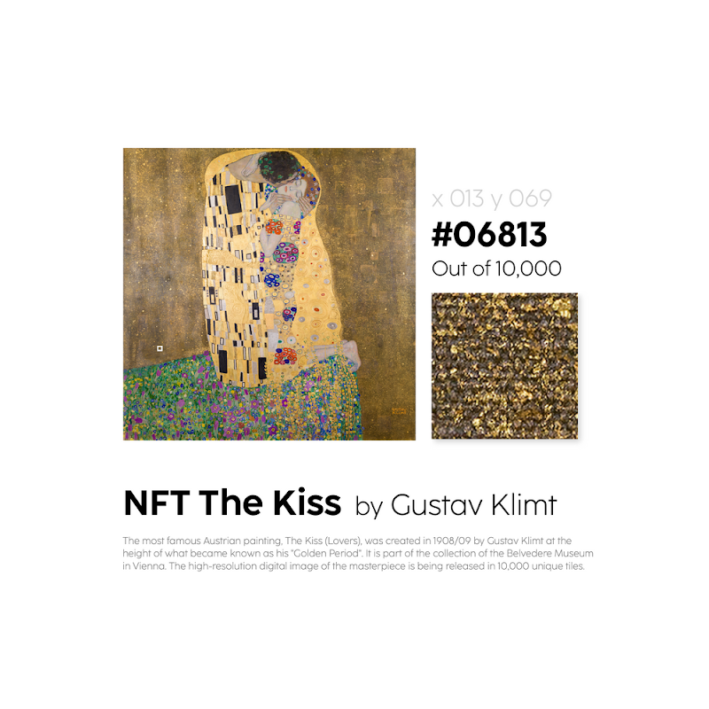

#### In honor of valentine's day the Belvedere Museum in Vienna offers Gustav Klimt's painting 'The Kiss' as fractionalized NFTs. I think it will be successful, but only for the seller.

--

Yesterday wasn't only valentines day but also the launch of an interesting experiment: tokenising Gustav Klimt's "The Kiss", a famous painter (1862-1918). The artwork isn't on the market but held by an Austrian museum offering customers to mint a piece of it.

* Mint: https://thekiss.art
* OS: https://opensea.io/collection/belvedere-arteq-the-kiss-by-gustav-klimt

An NFT was sold for around $2100 (~ 0.68 ETH) with a total of 10,000 tokens. 1 day later the volume traded is still pretty low at 19.8 E and the collection has 1.5K

While I think this must have been a success for the seller (the museum) I am still unsure if there actually is a market for this. It kind of reminds of buying a star and acquiring the rights to name it (perfect valentines gift).

Recycling analog art might work for the long term and typical art investor but the NFT space isn't comprised of that many at the moment. It's all about pfps, projects with a strong community, DAOs that come with benefits, etc.

Digital artists like @tylerxhobbs with the Fidenza, @refikanadol with Synthetic dreams or @eko33 with on-chain art are part of the 1/1 market but they're also active on twitter and resonate with the younger NFT crowd.

I didn't mint, I didn't buy and I won't buy things like this for a loooooong time.

**Update:** Floor price is currently at &darr; 0.4 ETH (June 5th, 2022)
