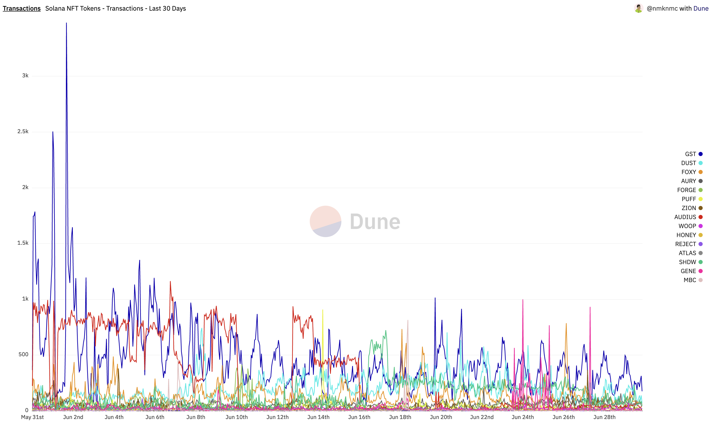
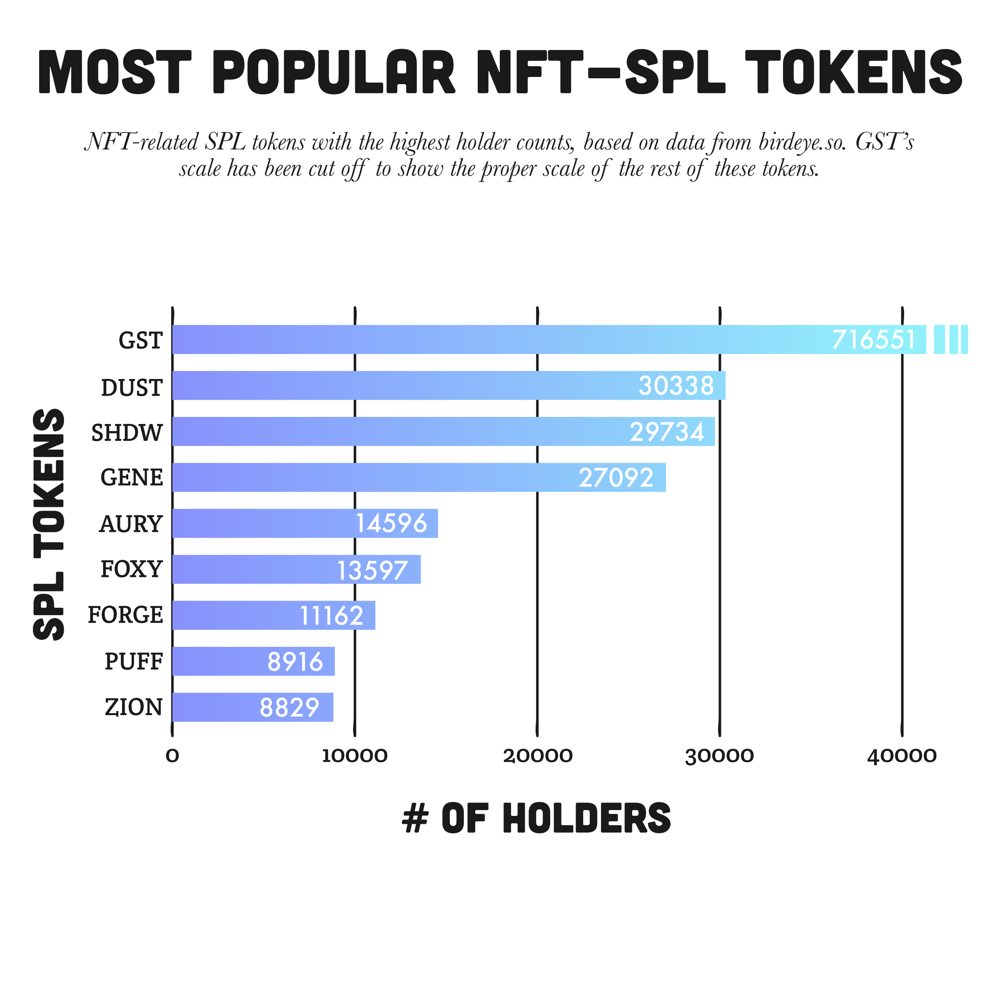
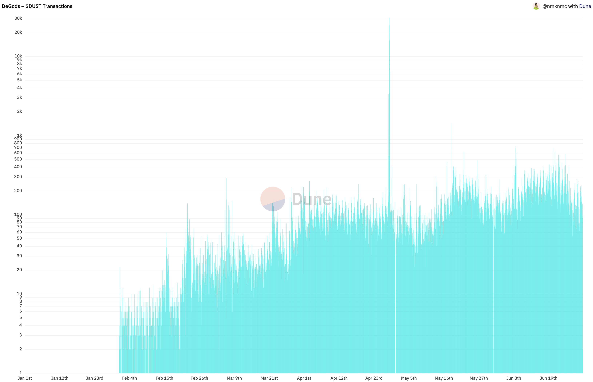
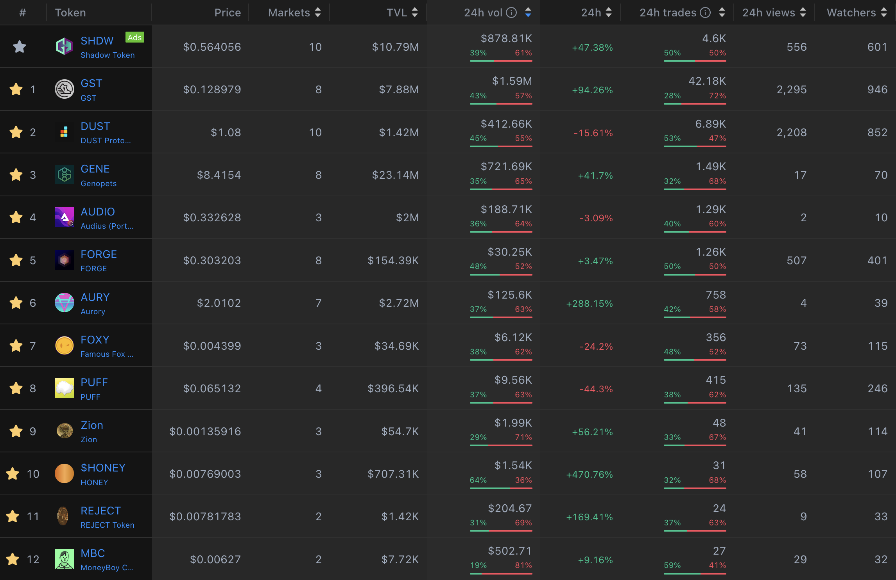
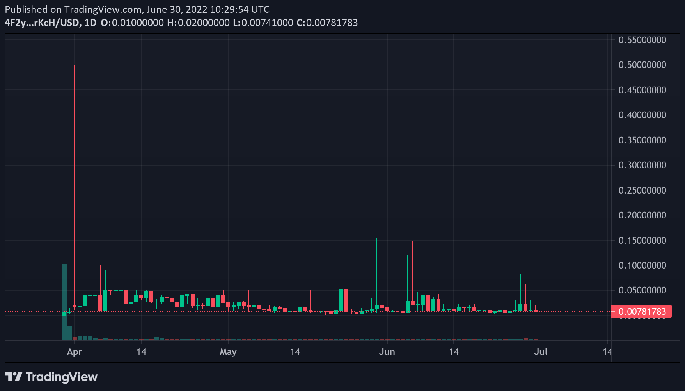
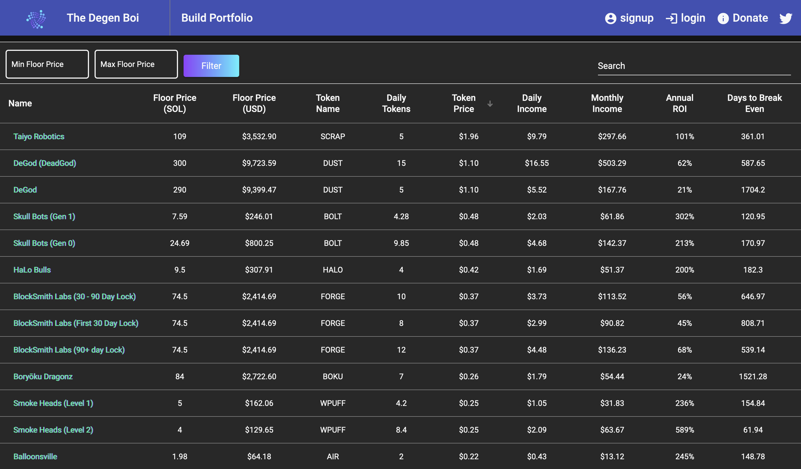

#### Gazillion NFT projects mint(ed) each day. A lot of them offer staking to receive an ecosystem token that hopefully provides utility and appreciates in price. Let's look into which are actually successful.

--

In the bull market, that is now behind us, hundreds of NFT projects minted each day with a lot of generated hype. Some were wildly successful, some were rugs, some were slow rugs... Quite a lot also offer staking an NFT to receive a token you can use and hopefully appreciates in price. Which ones are actually successful? Let's take a quick look.

> Wen token? Token too much, no moon!

### Most popular NFT tokens by holder count
$GST, by lifestyle app [Stepn](https://www.stepn.com) has seen by far the biggest adoption with close to one million wallets holding the token. $DUST by [DeGods](https://degods.com) comes second in proximity to $SHDW and $GENE, then it unique holder count decreases pretty quickly.

| Rank | Token         | Collection     | Wallets |
|--:|--------------|-----------|------------:|
| 1 | **$GST**          | StepN      | 716,551        |
| 2 | **$DUST**      | DeGods  | 30,338       |
| 3 | **$SHDW**      | Shadowy Super Coder  | 29,734       |
| 4 | **$GENE**      | Genopets  | 27,092       |
| 5 | **$AURY**      | Aurory Project  | 14,596       |
| 6 | **$FOXY**      | Famous Fox Federation  | 13,597       |
| 7 | **$FORGE**      | Blocksmith Labs  | 11,162       |
| 8 | **$PUFF**      | Stoned Ape Crew  | 8,916       |
| 9 | **$ZION**      | Blocksmith Labs  | 8,829       |
| 10 | **$HONEY**      | Honeybees  | 5,978       |

Source: [@The_Merkinator](https://twitter.com/The_Merkinator/status/1542353296760770562) + [Birdeye](https://birdeye.so)

[@The_Merkinator](https://twitter.com/The_Merkinator/status/1542353296760770562)

### Most used tokens in transactions
Taking the most popular NFT tokens by holder count and looking at their total transactions, you can see GST and DUST are consistently highest, while others only briefly spike and/or are much further behind. Staking might provide you with tokens but that doesn't mean they can be used for anything or actually have any value. That becomes apparent when you look at their $USD notation (see below)

<iframe width="100%" src="https://dune.com/embeds/979455/1696654/d8502ad9-91b9-4a5e-b8b8-7c8a6bfbab13" style="border: 1px solid #000; height: 400px"></iframe>

[Dune Dashboard with all tokens &rarr;](https://dune.com/nmknmc/solana-nft-token-stats)

While $GST is in decline, $DUST transactions are on the rise which speaks for a healthy usage growth of the DeGods ecosystem. 🤩 In a bear market it's pretty natural that you see more selling pressure though.

###### DeGods $DUST Growth over the last 180 days

### Price action of NFT tokens
Far down in usage are once hyped tokens from projects like Monke Rejects (24hr volume: $204.67), Moneyboys (24hr vol: $502.71) and others. This culminates in catastrophic price action and abysmal trading volume.

###### Solana Monke Rejects / $REJECT price action is flat**

### NFT Staking Token returns

As mentioned, the list of NFT projects providing you with tokens in return is long. Looking at the list below, sorted by token price descending, some of the projects indeed generate a nice amount of magic internet money per day. The investment you need to make in order to join is high though. For most: even if your NFT would generate hundreds of tokens, when multiplied by token price, you wouldn't get much USD in return.

[Token Returns by The Degen Boi](https://www.thedegenboi.com)

Oh la la, [Frank](https://twitter.com/frankdegods)!

> Dive deeper by looking at the [Dune Dashboard](https://dune.com/nmknmc/solana-nft-token-stats) I built and send me any feedback you might have on twitter.
