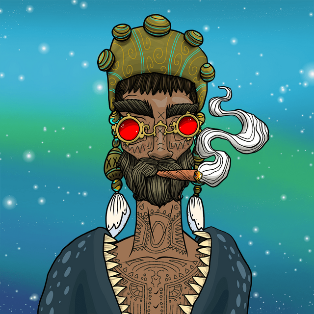
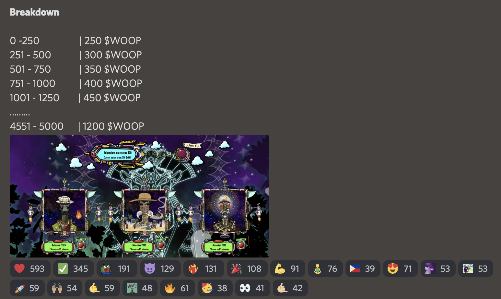
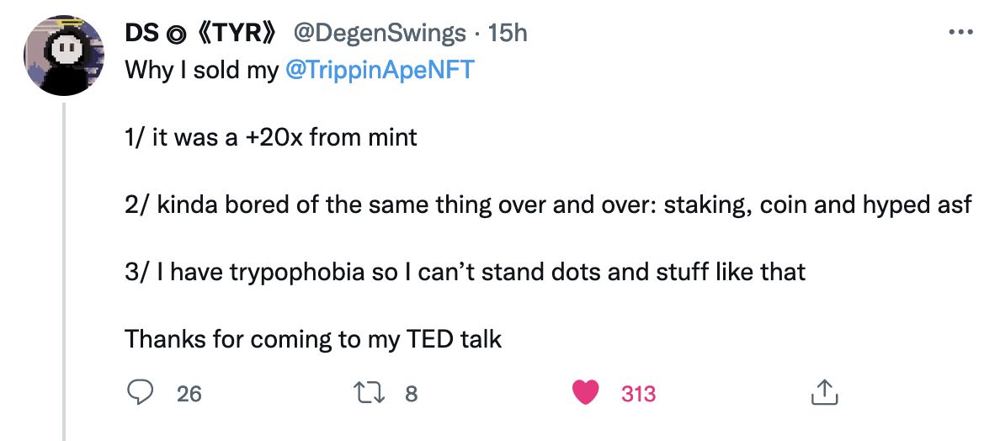
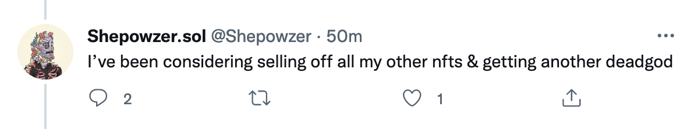
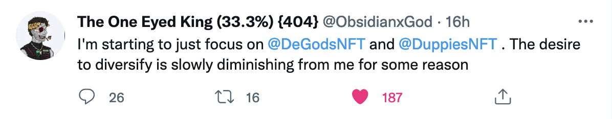

#### Investing into an NFT, staking it, claiming tokens and staying up-to-date is challenging. Multiply that by the number of NFT collections you're involved in and it's super stressful.

--

Today I discovered the [Bohemia Art Fair](https://twitter.com/BohemiaArtFair) NFT I am holding should have already gone into the Ayahuascan Retreat (say what?) as announced in their Discord one day ago. It takes 1 Bohemian, 1 Master Guru Letter and originally 250 WOOP...which I have... to be able to join. What was also announced in the Bohemian Discord is that every 250 Bohemians joining the amount of WOOP needed increases... and I was (too) late.

This triggered a bunch of thoughts in my head, most importantly:

**I want to have more high conviction plays and spend less time monitoring gazillion discords and project statuses.**

Also on my list of thoughts:

* I don't want to spend my precious SOL to buy more WOOP to push my Bohemian to generate more WOOP then convert it to SOL again at some point when the stars align
* I want to concentrate on fewer high conviction plays (aka "blue chips") like DeGods, Duppies, OkayBears
* I need to force myself not to ape into that many projects just because I read something on twitter and get FOMO
* I have limited time and want to spend it differently, I don't want to monitor gazillion discords and figure out the nuances, roadmaps and timelines
* I'm bored of clicking buttons to stake and claiming tokens on multiple websites

Don't get me wrong. Bohemia Art Fair is amazing and I love the art. I just have very limited time and the time I have I want to invest into IRL more.

#### Holding NFTs and clicking buttons

When you hold an NFT that provides staking you not only have 1 price to check but a bunch of things, namingly:
1. **NFT floor price movements**, i.e. when is it the right time to sell the NFT you acquired
1. **Tokenomics**, i.e. how many tokens get generated through NFT staking and what is their price on which exchange so you can sell them when the time is right
1. **Solana price**, i.e. what is the underlying SOL price this all depends on.
1. **Project announcements**, i.e. checking the Discord for the latest announcements, cross-checking with the general chat to see what people think

#### Other people, same thoughts!?

Looking at my twitter timeline I'm increasingly seeing other people mentioning a similar feeling. It will be interesting to see if this is just temporary or will remove liquidity from a bunch of "average projects".

[@DegenSwings](https://twitter.com/DegenSwings/)

[@Shepowzer](https://twitter.com/Shepowzer)

[@ObsidianxGod](https://twitter.com/ObsidianxGod)
